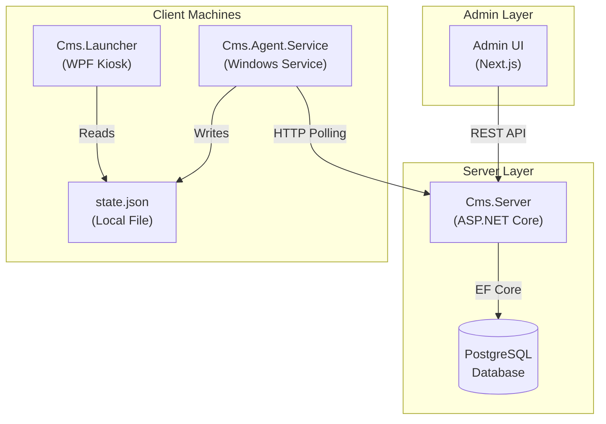
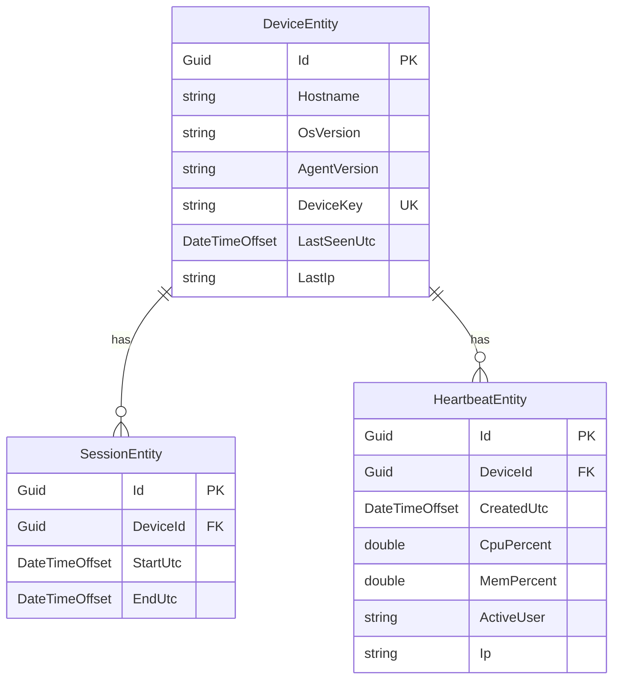
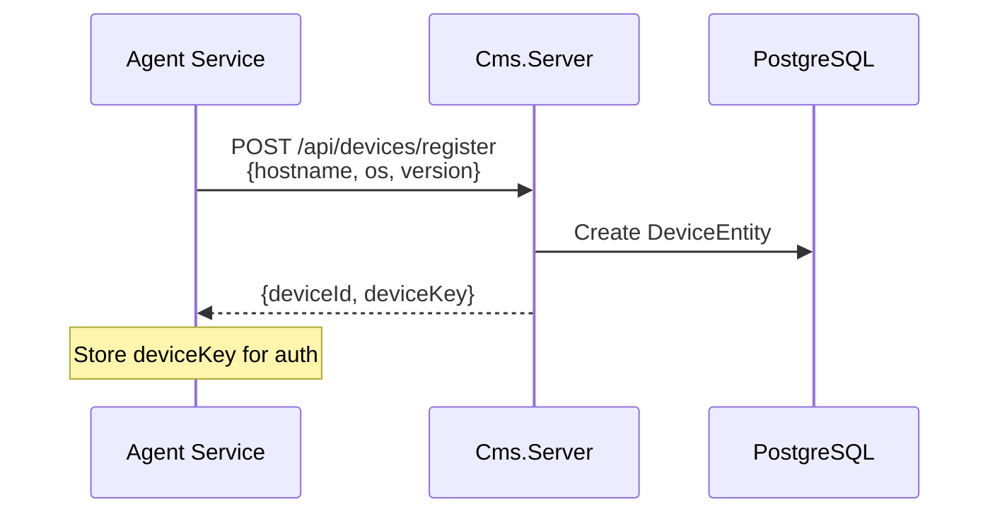
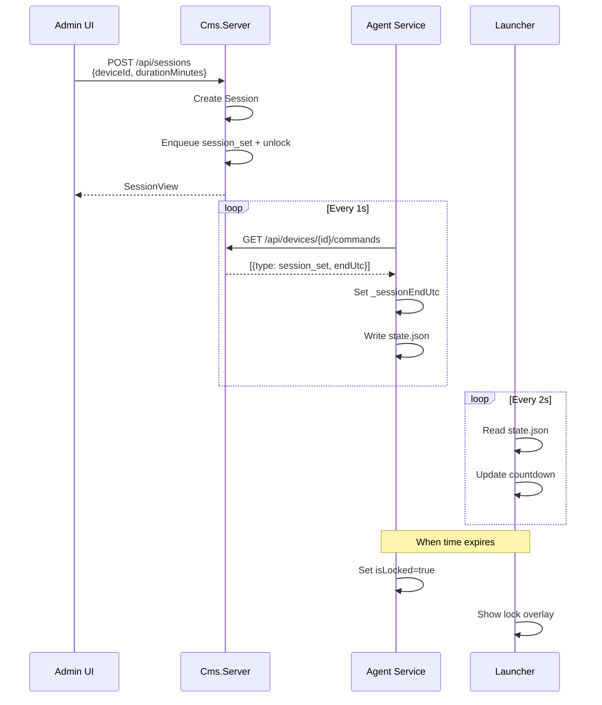

# PC Club Management System — Architecture

## Overview

The PC Club Management System is a distributed application for managing gaming PCs in a cybersport club environment. It enables central control of Windows gaming stations including session management with time limits, device locking/unlocking, and remote commands.



---

## Solution Structure

| Project | Type | Description |
|---------|------|-------------|
| [Cms.Server](file:///f:/v.wae/club-management-system/Cms.Server) | ASP.NET Core Web API | Central management server with REST endpoints |
| [Cms.Agent.Service](file:///f:/v.wae/club-management-system/Cms.Agent.Service) | .NET Worker Service | Windows background service running on each PC |
| [Cms.Launcher](file:///f:/v.wae/club-management-system/Cms.Launcher) | WPF Application | Kiosk UI with lock screen overlay |
| [Cms.Shared](file:///f:/v.wae/club-management-system/Cms.Shared) | Class Library | Shared contracts (currently minimal) |
| [admin-ui](file:///f:/v.wae/club-management-system/admin-ui) | Next.js | Web dashboard for administrators |

---

## Component Details

### 1. Cms.Server (Central API)

**Technology**: ASP.NET Core 8, Entity Framework Core, PostgreSQL

**Entry Point**: [Program.cs](file:///f:/v.wae/club-management-system/Cms.Server/Program.cs)

**Key Components**:

| File | Purpose |
|------|---------|
| [DevicesController.cs](file:///f:/v.wae/club-management-system/Cms.Server/Controllers/DevicesController.cs) | Device registration, heartbeats, command queue |
| [SessionsController.cs](file:///f:/v.wae/club-management-system/Cms.Server/Controllers/SessionsController.cs) | Session start/end, duration management |
| [CmsDbContext.cs](file:///f:/v.wae/club-management-system/Cms.Server/Data/CmsDbContext.cs) | EF Core DbContext with entity definitions |
| [IDeviceRepository.cs](file:///f:/v.wae/club-management-system/Cms.Server/Repositories/IDeviceRepository.cs) | Device operations interface |
| [ISessionRepository.cs](file:///f:/v.wae/club-management-system/Cms.Server/Repositories/ISessionRepository.cs) | Session operations interface |

**REST API Endpoints**:

```
POST /api/devices/register       → Register new device
POST /api/devices/heartbeat      → Agent heartbeat (X-Device-Key header)
GET  /api/devices                → List all devices
POST /api/devices/{id}/commands  → Enqueue command for device
GET  /api/devices/{id}/commands  → Poll pending commands
POST /api/devices/{id}/commands/{cmdId}/ack → Acknowledge command

POST /api/sessions               → Start new session
POST /api/sessions/{id}/end      → End session early
GET  /api/sessions               → List all sessions
```

---

### 2. Cms.Agent.Service (Windows Service)

**Technology**: .NET 8 Worker Service, runs as Windows Service

**Entry Point**: [Worker.cs](file:///f:/v.wae/club-management-system/Cms.Agent.Service/Worker.cs)

**Responsibilities**:
1. **Self-Registration**: Registers with server on first start, stores `deviceId` and `deviceKey`
2. **Heartbeat Loop**: Sends heartbeat every 1 second with system metrics
3. **Command Polling**: Fetches and executes pending commands from server
4. **Session Enforcement**: Tracks session end time, manages lock state
5. **State File Management**: Writes `state.json` for Launcher to read

**Supported Commands**:

| Command | Action |
|---------|--------|
| `lock` | Lock the PC (write lock state to file) |
| `unlock` | Unlock the PC |
| `restart` | Schedule system restart in 5 seconds |
| `message` | Log message (UI popup planned) |
| `session_set` | Set session end time |

**Local State Communication**:
```
%ProgramData%\ClubAgent\
├── state.json           # Lock state + remaining seconds
└── agent_heartbeat.txt  # Agent liveness marker
```

---

### 3. Cms.Launcher (Kiosk UI)

**Technology**: WPF (.NET 8), runs in full-screen kiosk mode

**Entry Point**: [MainWindow.xaml.cs](file:///f:/v.wae/club-management-system/Cms.Launcher/MainWindow.xaml.cs)

**Features**:
- Full-screen overlay when PC is locked
- Session countdown timer display
- Keyboard blocking when locked (via [KeyboardBlocker.cs](file:///f:/v.wae/club-management-system/Cms.Launcher/KeyboardBlocker.cs))
- Staff unlock with PIN (`Ctrl+Shift+U`, PIN: `1234`)
- Fail-open mechanism: unlocks if agent heartbeat is stale (>15s)

**State Polling**:
- Reads `state.json` every 2 seconds
- Shows/hides lock overlay based on `isLocked` field
- Displays remaining time from `remainingSeconds` field

---

### 4. Admin UI (Next.js)

**Technology**: Next.js 14, React, Tailwind CSS

**Entry Point**: [page.tsx](file:///f:/v.wae/club-management-system/admin-ui/app/page.tsx)

**Features**:
- Real-time device list (polls every 5 seconds)
- Device status indicators (online/offline)
- Quick action buttons: Lock, Unlock, Restart, Start Session
- Session duration prompt

---

## Data Model



---

## Communication Flow

### Device Registration


### Session Lifecycle


---

## Deployment Architecture

```
┌─────────────────────────────────────────────────────────────┐
│                     Admin Workstation                        │
│  ┌─────────────────┐                                        │
│  │   Admin UI      │◄────────────── HTTP :3000              │
│  │   (Next.js)     │                                        │
│  └────────┬────────┘                                        │
│           │                                                  │
└───────────┼──────────────────────────────────────────────────┘
            │ REST API
            ▼
┌─────────────────────────────────────────────────────────────┐
│                      Server (On-Prem)                        │
│  ┌─────────────────┐     ┌─────────────────┐                │
│  │   Cms.Server    │────►│   PostgreSQL    │                │
│  │   (Kestrel)     │     │   :5432         │                │
│  │   :5081         │     └─────────────────┘                │
│  └─────────────────┘                                        │
└───────────┬──────────────────────────────────────────────────┘
            │ HTTP Polling
            ▼
┌─────────────────────────────────────────────────────────────┐
│                    Gaming PC (Windows 11)                    │
│  ┌─────────────────┐     ┌─────────────────┐                │
│  │ Cms.Agent       │────►│ state.json      │                │
│  │ (Windows Svc)   │     └────────┬────────┘                │
│  └─────────────────┘              │                         │
│                                   ▼                         │
│                      ┌─────────────────┐                    │
│                      │  Cms.Launcher   │                    │
│                      │  (WPF Kiosk)    │                    │
│                      └─────────────────┘                    │
└─────────────────────────────────────────────────────────────┘
```

---

## Security Considerations

| Aspect | Implementation |
|--------|----------------|
| **Agent Authentication** | `X-Device-Key` header on all agent requests |
| **Device Key Storage** | Unique key per device, stored in memory (per session) |
| **Admin API** | Open CORS in dev; intended to restrict in production |
| **Staff Unlock** | Local PIN bypass (`1234`) for emergency access |
| **Fail-Open** | Launcher unlocks if agent heartbeat stale >15s |

---

## Technology Stack

| Layer | Technology |
|-------|------------|
| **Server** | .NET 8, ASP.NET Core, EF Core, PostgreSQL |
| **Agent** | .NET 8 Worker Service, Windows Service |
| **Launcher** | .NET 8, WPF, Windows Low-Level Keyboard Hook |
| **Admin UI** | Next.js 14, React, Tailwind CSS |
| **Build** | Visual Studio 2022, dotnet CLI, npm |

---

## Related Documentation

- [ProjectPlan.md](file:///f:/v.wae/club-management-system/docs/ProjectPlan.md) — Strategy, milestones, and detailed planning
- [TestChecklist.md](file:///f:/v.wae/club-management-system/docs/TestChecklist.md) — Manual testing procedures
